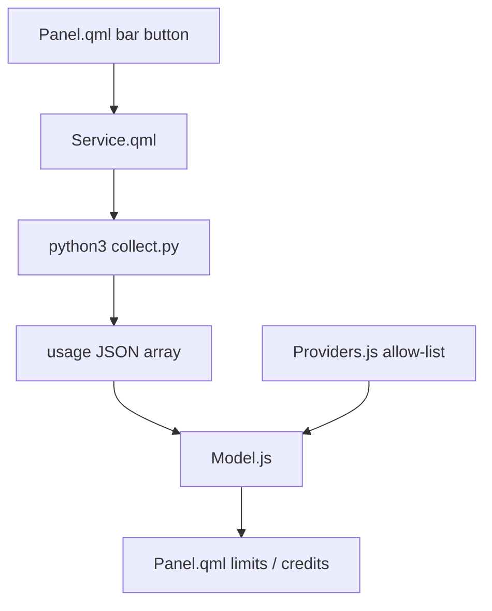

# Project instructions

## Commands

- Install: clone this repo, then `omarchy plugin add <git-url> --enable`
- Test: `make test`
- QML lint (Omarchy machine only): `make qml-check`
- Validate: `make validate`
- Local load without git: symlink into `~/.config/omarchy/plugins/shuuul.token-monitor`

## Reload after a change — do this before asking the user to check

Quickshell caches compiled QML. A file save or `rescanPlugins` is **not** enough
for `Panel.qml` / `Service.qml` edits. The bar will keep showing the old layout
(for example seven monogram letters) until the shell process restarts.

After any QML, `collect.py`, or `manifest.json` change:

1. `make test`
2. `omarchy restart shell`
3. Wait until `omarchy-shell shell ping` prints `ok` (about 2 seconds)
4. `omarchy-shell shuuul.token-monitor refresh`
5. Confirm the cache is new: `ls -lt ~/.cache/quickshell/qmlcache | head`
6. Then tell the user to click Token Monitor

`omarchy-shell shell rescanPlugins` only rediscovers plugin folders. Use it when
the symlink or `manifest.json` id changed, then still do step 2.

Do not ask the user to verify a UI change until step 2 has run in this session.

## Conventions

- Use Conventional Commits: `<type>(<scope>): 
`.
- Do not commit secrets, CodexBar config, cookies, or API keys.
- Provider IDs must match CodexBar exactly: `amp`, `codex`, `kimi`, `cursor`, `grok`, `notion`, `zed`.
- Kimi has two regions. Check both: `kimi.com` (China) and `kimi.ai` (international). Pair tokens/cookies only with the matching host.
- Plan labels: Codex `prolite` is Pro 5x, `pro` is Pro 20x. Kimi billed tier is `/coding/v1/me` `user_level_name` (Allegretto, not `membership.level`). Notion billed tier is space `subscription_tier`. Grok billed tier is `/v1/settings` `subscription_tier_display` when present, otherwise `accounts.x.ai` `xSubscriptionType` (Premium → X Premium). Do not invent Free.
- The bar icon and label follow the panel's selected provider. Without a selection they still fall back to the fullest usage window.
- Do not add Claude, OpenAI admin, xAI, or any other CodexBar provider unless the user expands the allow-list.
- Provider HTTP and Chrome cookie import live in `collect.py`. Do not print cookies or tokens.
- `collect.py` must inherit the Omarchy shell environment. Do not rewrite `HOME` or `PATH` in the Process argv; an empty `HOME` makes Amp look like `No such file` and every cookie provider look signed out.
- QML colors come from `qs.Commons.Color` and `Style`. No hard-coded hex.
- Nested `Component {}` blocks must not reference `root.`; `BarIconButton` and `PanelHero` also use that name.

## Architecture

## Local AGENTS.md hierarchy

None yet. Keep parsing in `Model.js` / `Providers.js` so node can test it without Quickshell.
