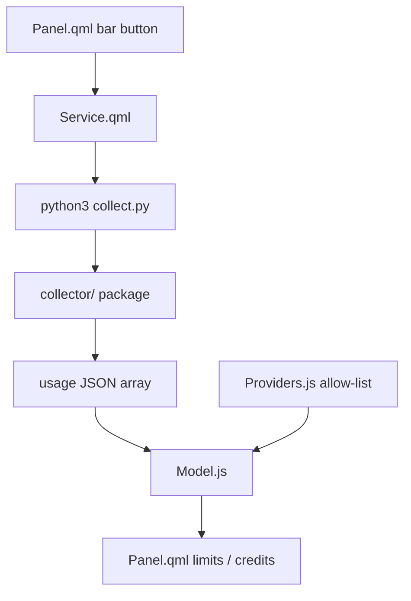

# Project instructions

## Commands

- Install: clone this repo, then `omarchy plugin add <git-url> --enable`
- Test: `make test`
- QML lint (Omarchy machine only): `make qml-check`
- Validate: `make validate`
- Local load without git: symlink into `~/.config/omarchy/plugins/shuuul.token-monitor`

## Reload after a change — do this before asking the user to check

Quickshell caches compiled QML. A file save or `rescanPlugins` is **not** enough
for `Panel.qml` / `Service.qml` edits. The bar will keep showing the old layout
(for example seven monogram letters) until the shell process restarts.

After any QML, Python collector, or `manifest.json` change:

1. `make test`
2. `omarchy restart shell`
3. Wait until `omarchy-shell shell ping` prints `ok` (about 2 seconds)
4. `omarchy-shell shuuul.token-monitor refresh`
5. Confirm the cache is new: `ls -lt ~/.cache/quickshell/qmlcache | head`
6. Then tell the user to click Token Monitor

`omarchy-shell shell rescanPlugins` only rediscovers plugin folders. Use it when
the symlink or `manifest.json` id changed, then still do step 2.

Do not ask the user to verify a UI change until step 2 has run in this session.

## Conventions

- Use Conventional Commits: `<type>(<scope>): 
`.
- Do not commit secrets, CodexBar config, cookies, or API keys.
- Provider IDs must match CodexBar exactly: `amp`, `codex`, `kimi`, `cursor`, `grok`, `notion`, `zed`, `factory`. `factory` displays as Droid.
- Provider icons in `assets/<id>.svg` must come from CodexBar `Sources/CodexBar/Resources/ProviderIcon-<id>.svg`, with fills rewritten to `#ffffff` so `MultiEffect` can tint them to the bar foreground. Do not leave `currentColor` (Qt paints that as black). Do not invent monograms.
- Kimi has two regions. Check both: `kimi.com` (China) and `kimi.ai` (international). Pair tokens/cookies only with the matching host.
- Plan labels: Codex `prolite` is Pro 5x, `pro` is Pro 20x. Kimi billed tier is `/coding/v1/me` `user_level_name` (Allegretto, not `membership.level`). Notion billed tier is space `subscription_tier`. Grok billed tier is CLI-proxy `/v1/settings` `subscription_tier_display` from `~/.grok/auth.json` SuperGrok OIDC when present, otherwise cookie `/v1/settings`, then `accounts.x.ai` `xSubscriptionType` (Premium → X Premium). OIDC without a billed overlay is SuperGrok. Do not invent Free.
- The bar shows the selected provider icon plus two remaining meters: weekly on top, session underneath. Do not put the provider name or percent text in the bar slot. Grok's single credits window is weekly, not session. Cursor uses Cursor Models on top and Third-Party underneath. Amp's subscription "other usage" window is Token Usage. Codex extra windows are Codex Spark Session / Codex Spark Weekly. Notion windows are Rolling and Monthly. Factory token-rate-limits lists seven rows: 5h, Weekly, Monthly, Core 5h, Core 7-day, Core Monthly, Extra usage. Do not collapse Core windows into Session/Weekly/Monthly. The bar still uses standard Weekly on top and 5h underneath. Legacy Factory windows are Standard (session) and Premium (weekly).
- Tint provider SVGs with `MultiEffect` to the bar foreground, like symbolic tray icons. Keep the icon and the two bars the same height (`Style.bar.iconCanvas`) and vertically centered together.
- Never paint usage meters or the bar button in urgent red. A failed refresh must keep the last good snapshot instead of clearing the bars.
- Update age lives under the selected provider, above Refresh. The Usage dashboard button opens that provider's CodexBar `dashboardURL` in the browser. Zed has none, so hide the button. The Refresh button fetches only that provider and merges it into the existing snapshot.
- Panel settings live behind the hero gear: refresh interval (default 5 minutes), refresh on open (default off), show remaining vs used (default remaining), hide email (default off), Chrome/Chromium cookies, and per-provider enablement. Persist with `bar.shell.updateEntryInline`. Settings rows can be dragged to set `providerOrder`; the main provider switch uses that same order. Opening the panel fetches every provider only when refresh on open is enabled. Remember `selectedProviderId` so opening the panel does not jump to the most-used headline. The account email belongs only in the hero line, not under the provider switch.
- Do not add Claude, OpenAI admin, xAI, or any other CodexBar provider unless the user expands the allow-list. Factory/Droid is already on the allow-list.
- Provider HTTP and Chrome cookie import live in `collector/`; root `collect.py` is only the stable executable entry point. Do not print cookies or tokens.
- The Python collector must inherit the Omarchy shell environment. Do not rewrite `HOME` or `PATH` in the Process argv; an empty `HOME` makes Amp look like `No such file` and every cookie provider look signed out.
- QML colors come from `qs.Commons.Color` and `Style`. No hard-coded hex.
- Nested `Component {}` blocks must not reference `root.`; `BarIconButton` and `PanelHero` also use that name.

## Security boundaries — preserve these

Provider responses, local auth files, keyring output, browser cookies, subprocess
output, settings, and collector JSON are untrusted input. The limits in
`collector/security.py`, `collector/http.py`, `collector/cookies.py`, `Model.js`,
and `Service.qml` are product invariants, not optional hardening.

- Use `read_bytes`, `read_text`, or `read_json` for auth/config files and
  `bounded_secret` for tokens, cookie values, account IDs, and API keys. Do not
  add unbounded `Path.read_*` calls for credentials. Kimi credential refreshes
  must remain an atomic same-directory replace with directory mode `0700` and
  file mode `0600`.
- Run local commands with `run_bounded`, an argument array, an explicit timeout,
  and an output cap. Do not use `shell=True`, unbounded `subprocess.run`, or hold
  arbitrary command output in memory. Preserve the inherited shell environment;
  do not synthesize or clear `HOME` or `PATH`.
- Send provider requests only through `collector.http.http`. It enforces HTTPS,
  an exact hostname allow-list, disabled redirects, bounded request headers and
  bodies, and bounded responses. Every call must set a provider-appropriate
  `max_bytes`. Adding a host requires explicit review and an update to
  `ALLOWED_HTTPS_HOSTS`; never replace it with wildcard or suffix matching and
  never enable authenticated redirects.
- Read only the named cookies providers need. Keep the cookie database, row,
  hostname, encrypted-value, decrypted-secret, and assembled-header limits.
  Cookie domains may match only the approved domain itself or a dot-delimited
  subdomain; substring checks such as `wanted in host` are forbidden.
- Never print or return tokens, cookies, authorization headers, raw auth files,
  or provider payloads. Provider-controlled display data must pass through
  `row` / `bounded_value`, and final stdout must use `snapshot_json`. Preserve
  the 64 KiB snapshot/settings boundary, collection/depth/text caps, bounded QML
  stdout/stderr accumulation, and the last-good-snapshot behavior on failure.
- Security boundary changes require focused coverage in `tests/test_security.py`
  or the relevant provider test, followed by `make test`. Do not raise or remove
  a limit merely to make a failing payload pass; confirm the smallest safe bound
  from the provider contract.

## Architecture

## Local AGENTS.md hierarchy

None yet. Keep parsing in `Model.js` / `Providers.js` so node can test it without Quickshell.
