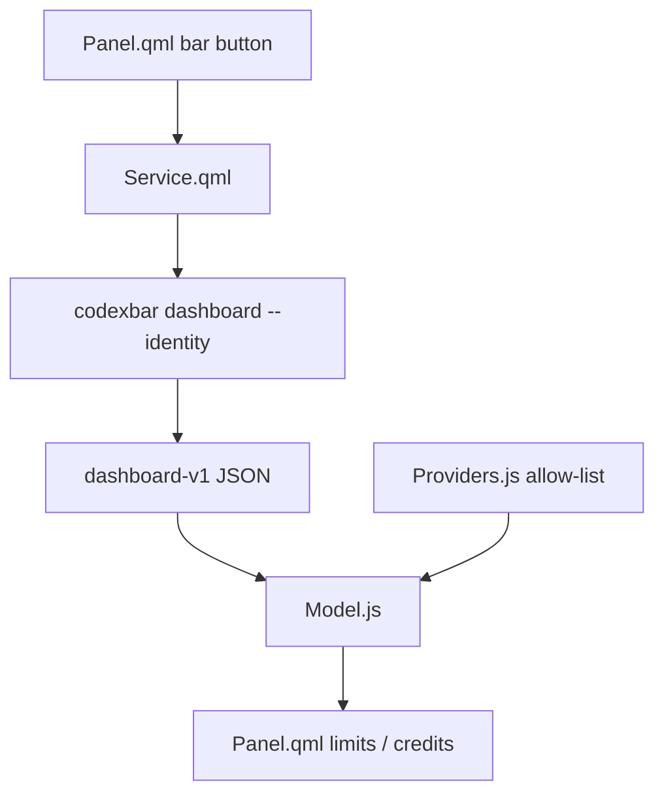

# Project instructions

## Commands

- Install: clone this repo, then `omarchy plugin add <git-url> --enable`
- Test: `make test`
- QML lint (Omarchy machine only): `make qml-check`
- Validate: `make validate`
- Local load without git: symlink into `~/.config/omarchy/plugins/shuuul.token-monitor`

## Conventions

- Use Conventional Commits: `<type>(<scope>): 
`.
- Do not commit secrets, CodexBar config, cookies, or API keys.
- Provider IDs must match CodexBar exactly: `amp`, `codex`, `kimi`, `cursor`, `grok`, `notion`, `zed`.
- Do not add Claude, OpenAI admin, xAI, or any other CodexBar provider unless the user expands the allow-list.
- Do not reimplement provider auth or HTTP. Call `codexbar dashboard` and render the dashboard-v1 snapshot.
- QML colors come from `qs.Commons.Color` and `Style`. No hard-coded hex.
- Nested `Component {}` blocks must not reference `root.`; `BarIconButton` and `PanelHero` also use that name.

## Architecture

## Local AGENTS.md hierarchy

None yet. Keep parsing in `Model.js` / `Providers.js` so node can test it without Quickshell.
