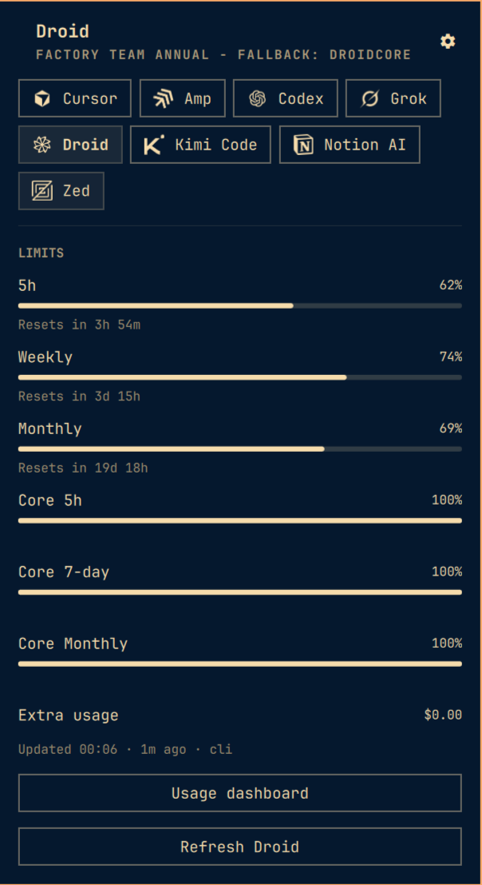

# Token Monitor for Omarchy

An Omarchy bar panel for AI coding quotas: Amp, Codex, Kimi Code, Cursor, Grok,
Notion AI, Zed, and Droid.

Use it to see remaining weekly and session usage next to the selected provider
icon, open a panel for the supported accounts, and refresh one provider
at a time.

Provider IDs match [CodexBar](https://github.com/steipete/CodexBar) exactly.
The panel does not run the CodexBar CLI. It reads the same local sessions this
machine already has: Chrome cookies, CLI auth files, and the Linux keyring.

The provider list is deliberately limited to AI services I can test on this
machine — every row in the sign-in map is verified against a live session, not
an API guess. If you use a CodexBar provider that is missing here, or another
AI coding service you want tracked, contributions are welcome, see
[Contributing](#contributing).



## Requirements

- Omarchy
- Python 3
- Google Chrome or Chromium, for Cursor, Notion, Grok, and Amp cookies

## Getting Started

Sign in locally for the providers you use:

```bash
codex login
amp
kimi login
```

Sign in to cursor.com, app.notion.com, and grok.com in Chrome. Zed uses the
desktop client's Linux keyring item after `client: sign in`. Droid uses the
local `droid` login, `FACTORY_API_KEY` / `~/.factory/.env`, or app.factory.ai
Chrome cookies.

Install the Omarchy plugin:

```bash
omarchy plugin add https://github.com/shuuul/omarchy-token-monitor.git --enable
```

During local development, from this checkout:

```bash
./install.sh
```

Remove the Omarchy plugin:

```bash
omarchy plugin remove shuuul.token-monitor
```

The bar shows the selected provider icon and two remaining meters: weekly on
top, session underneath. Left click opens the panel. Right click refreshes the
selected provider. Middle click moves to the next one. Usage dashboard opens
the provider site CodexBar uses for leftover quota. Zed has no dashboard page.

## Why the Python collector exists

Quickshell QML cannot decrypt Chrome cookies, talk to Secret Service, or keep
OAuth refresh writes atomic. Those steps live in the `collector/` package. The
root `collect.py` is the stable executable entry point; the panel only renders
the JSON it prints.

The Python collector is required because:

- Chrome/Chromium cookies are an SQLite database encrypted with a key from
  `secret-tool`. QML has no AES or libsecret bindings.
- Zed stores `{user_id, token}` in the default keyring. The collector looks
  that item up and never prints the secret.
- Kimi tokens expire in minutes. The collector refreshes them and writes the
  file back `0600`.
- Amp usage is a local CLI (`amp usage`). Codex is `~/.codex/auth.json`.
- The process must inherit the Omarchy shell environment. An empty `HOME`
  makes Amp look like `No such file` and every cookie provider look signed out.

Stdout is one JSON array. Cookies and tokens never appear there.

## Sign-in map

| Provider | CodexBar ID | How this panel reads it |
| --- | --- | --- |
| Amp | `amp` | `amp usage`, then Chrome cookies |
| Codex | `codex` | `~/.codex/auth.json` |
| Kimi Code | `kimi` | `~/.kimi-code/credentials/` on kimi.com and kimi.ai |
| Cursor | `cursor` | Chrome cookie `WorkosCursorSessionToken` |
| Grok | `grok` | `grok login` / `~/.grok/auth.json`, then Chrome cookies `sso` / `sso-rw` |
| Notion AI | `notion` | Chrome cookie `token_v2` |
| Zed | `zed` | Linux keyring item `zed-github-account` |
| Droid | `factory` | `droid` CLI keyring, `FACTORY_API_KEY`, or Chrome cookies |

## Settings

In `~/.config/omarchy/shell.json`, on the `shuuul.token-monitor` entry:

| Key | Default | Meaning |
| --- | --- | --- |
| `browser` | `chrome` | `chrome` or `chromium` cookies |
| `refreshIntervalSec` | `300` | Poll interval (5 minutes). Change it from the panel gear. |
| `refreshOnOpen` | `false` | Fetch every provider when the panel opens. Off by default. |
| `showRemaining` | `true` | Bar and limits show leftover quota. Off shows used. |
| `hideEmail` | `false` | Hide the account email on the panel. |
| `selectedProviderId` | `""` | Last provider shown in the bar and panel. |
| `providers.<id>.enabled` | `true` | Hide one of the supported providers |

Nested enablement needs the whole object:

```bash
omarchy bar set shuuul.token-monitor providers '{
  "amp": { "enabled": true },
  "codex": { "enabled": true },
  "kimi": { "enabled": true },
  "cursor": { "enabled": true },
  "grok": { "enabled": false },
  "notion": { "enabled": false },
  "zed": { "enabled": true },
  "factory": { "enabled": true }
}' --json
```

## Development

```bash
./install.sh --no-restart
make test
make validate
```

After a QML or Python collector change, restart the shell before checking the bar:

```bash
omarchy restart shell
omarchy-shell shuuul.token-monitor refresh
```

`rescanPlugins` only rediscovers plugin folders. It does not rebuild the
Quickshell QML cache.

## Contributing

The allow-list intentionally covers only AI services I can test on this
machine, so every meter in the panel is backed by a verified live session.
Other developers are welcome to contribute the services they use every day.

To add a provider:

1. Implement the fetch in `collector/` and wire it into `collect.py`. Keep
   cookies and tokens off stdout.
2. Add the provider ID to the `Providers.js` allow-list (it must match
   CodexBar exactly) and its parsing to `Model.js`, so node can test the
   parsing without Quickshell.
3. Add the monochrome icon at `assets/<id>.svg` — copied from CodexBar's
   provider SVGs with fills rewritten to `#ffffff`, no monograms.
4. Add a row to the sign-in map and update the panel description in
   `manifest.json`.
5. Run `make test` and `make validate`, then verify end to end on your own
   live session before opening the pull request.

## License

MIT. CodexBar, Amp, Codex, Kimi, Cursor, Grok, Notion, Zed, and Factory Droid
are separate products under their own licenses.
